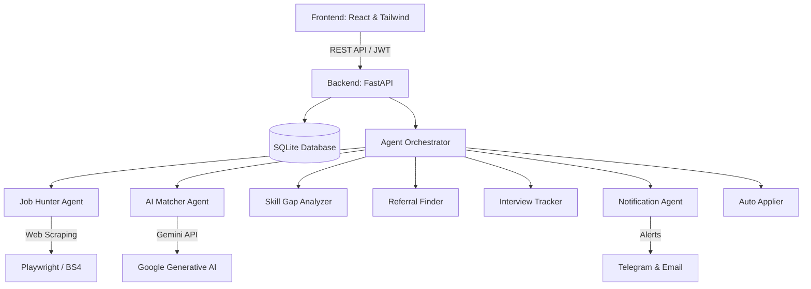

# 🤖 JobFinderAgent

An advanced, AI-powered multi-agent system designed to fully automate the job search lifecycle. From hunting and scraping jobs, to semantic matching, resume gap analysis, referral discovering, and automated notifications/applications—**JobFinderAgent** acts as your personal job search assistant.

---

## 🏗️ Architecture & Features



### 🧠 The Agents
1. **🔍 Job Hunter Agent**: Scrapes and aggregates job listings from various sources matching your target keywords and settings using `Playwright` and `BeautifulSoup4`.
2. **🤖 AI Matcher Agent**: Leverages **Google Gemini AI** to evaluate scraped job descriptions against your resume, returning a compatibility score and detailed fit reports.
3. **🎓 Skill Gap Analyzer Agent**: Analyzes job descriptions to pinpoint missing skills on your resume and suggests key learning materials/resources.
4. **🌐 Referral Finder Agent**: Scans target organizations and job listings to locate potential referral channels and networking opportunities.
5. **📅 Interview Tracker Agent**: Monitors the applications pipeline, logs interviews, and coordinates prep tasks.
6. **📢 Notification Agent**: Keeps you updated in real-time about matches and deadlines via **Telegram messages** and **Email alerts**.
7. **⚡ Auto Applier Agent**: Automates draft creation or completes submission steps on standard job portals.

---

## ⚙️ Project Structure

```text
Jobfinder/
├── src/
│   ├── agents/          # Multi-agent system logic
│   ├── api/             # FastAPI main entrypoint and routes
│   ├── services/        # Third-party integrations (Gemini, Playwright, Mail, Telegram)
│   ├── config.py        # System configuration and logic rules
│   └── database.py      # SQLite db schemas and database actions
├── frontend/            # React + Vite application (UI Dashboard)
├── deployment/          # Deployment-related scripts and backups
├── Dockerfile.backend   # Backend container configuration
├── Dockerfile.frontend  # Frontend container configuration
└── docker-compose.yml   # Multi-container orchestration config
```

---

## 🛡️ Setup & Installation

### 1. Environment Configuration (`.env`)
Create a `.env` file in the root directory. Use the following template:

```env
# Application Settings
APP_MODE=APPROVAL
DATABASE_URL=sqlite:///./data/jobfinder.db
JWT_SECRET=your_jwt_secret_key_here
ENCRYPTION_KEY=your_fernet_encryption_key_here

# LLM Configurations
GEMINI_API_KEY=your_gemini_api_key_here

# Notification Settings (Telegram)
TELEGRAM_BOT_TOKEN=your_telegram_bot_token_here
TELEGRAM_CHAT_ID=your_telegram_chat_id_here

# Email SMTP Settings (For sending alerts)
SMTP_SERVER=smtp.gmail.com
SMTP_PORT=587
SMTP_USERNAME=your_email@gmail.com
SMTP_PASSWORD=your_app_specific_password_here

# Email IMAP Settings (For tracking received replies)
IMAP_SERVER=imap.gmail.com
IMAP_PORT=993
IMAP_USERNAME=your_email@gmail.com
IMAP_PASSWORD=your_app_specific_password_here
```

### 2. Local Setup

#### Backend (FastAPI)
1. **Create and activate a virtual environment:**
   ```bash
   python -m venv venv
   # On Windows:
   venv\Scripts\activate
   # On macOS/Linux:
   source venv/bin/activate
   ```
2. **Install dependencies:**
   ```bash
   pip install -r requirements.txt
   ```
3. **Install Playwright Browsers:**
   ```bash
   playwright install
   ```
4. **Run the FastAPI server:**
   ```bash
   uvicorn src.api.main:app --reload --port 8000
   ```

#### Frontend (React + Vite)
1. **Navigate to the frontend directory:**
   ```bash
   cd frontend
   ```
2. **Install node packages:**
   ```bash
   npm install
   ```
3. **Run the development server:**
   ```bash
   npm run dev
   ```

---

## 🐳 Docker Deployment
To launch the entire platform (Frontend, Backend, and SQLite DB) in Docker containers:

```bash
docker-compose up --build
```
* The **Frontend** will be served at: `http://localhost:5173`
* The **Backend Docs** will be available at: `http://localhost:8000/docs`

---

## 📏 Business & Filtering Rules

- **Location-Based Filtration**: 
  - If a job is located in **India** (or major Indian cities like Bengaluru, Hyderabad, Pune, Mumbai, Gurgaon, Noida, Chennai, etc.), any mode (**Onsite, Hybrid, or Remote**) is acceptable.
  - If the job is located **outside India**, only **Remote** roles are processed to prevent relocation constraints.
- **Resume Matching Priority Boosts**:
  Jobs mentioning the following keywords receive priority scoring boosts:
  - `AI` & `Python`: +20 boost
  - `Data` & `Full Stack` & `General Developer`: +15 boost
  - `React` & `Node` & `Cloud` & `Testing` & `IT Support`: +10 boost